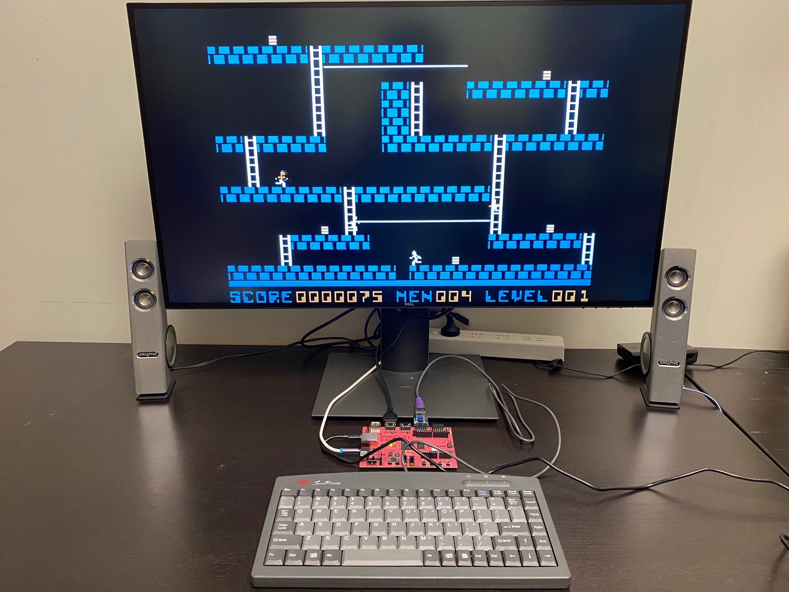

# Apple II+ Emulation on PYNQ-Z1
## NeoApple2 - A Port of Apple2fpga to Xilinx Zynq

Feng Zhou, 2021-7

EN | [中文](README.cn.md)

This is a port of Stephen A. Edwards's [Apple2fpga](http://www.cs.columbia.edu/~sedwards/apple2fpga/) to Xilinx Zynq platform.
It runs on the PYNQ-Z1 FPGA board and emulates an Apple II Plus computer on the board. Here are the main features,

 * Video output through the on-board HDMI port. 
 * PS/2 Keyboard input.
 * Sound output through the on-board 3.5mm mono line-out jack.
 * Switching between monochrome and color display modes.
 * Loading of floppy disk images through .nib files on MicroSD cards.



## Set up hardware and run the binary package

Easy way to get started is to [download the binary package](http://zhoufeng.net/neoapple2/). There is a BOOT.BIN file inside it. This includes everything you need in terms of software. Before
you can run that, however, you need the following hardware parts,

 * A [PYNQ-Z1](https://store.digilentinc.com/pynq-z1-python-productivity-for-zynq-7000-arm-fpga-soc/) FPGA board.
 * A [Pmod PS2](https://store.digilentinc.com/pmod-ps2-keyboard-mouse-connector/) adapter board for connecting the keyboard.
 * A PS/2 keyboard (not USB keyboard). 
 * A MicroSD card, for holding disk images.
 * A monitor with HDMI input.
 * A HDMI cable.
 * A MicroUSB cable.
 * A computer, to talk to Z1 over USB.
 * If you need sound, a 3.5mm audio cable from Z1 to speaker, or a headphone with 3.5mm plug.

To hook the hardware up,
 1. Plug the **Pmod PS2** into the upper level of PMODA socket on Z1. Then plug the PS/2 keyboard into the Pmod PS2.
 2. Connect the Z1 board to your monitor through the HDMI OUT port on Z1.
 3. Connect your speaker cable or headphone to the audio jack on the left side of Z1.
 4. Connect Z1 to your computer with the MicroUSB cable.
 5. Switch the JP4 jumper (top-left) to MicroSD position. In this setting the board boots from the MicroSD card.
 6. Plugging the MicroSD card it into your computer with a card reader. Then format it in FAT32 (exFAT probably also works). Then copy the `BOOT.BIN` file to the root directory.
 7. Copy any Apple II disk images you have to the MicroSD card, also root dir. The [Internet Archive](https://archive.org/) has a rich library of these. Only `.nib` files are supported. 
    But `.dsk` and `.do` can easily be converted to `.nib` by [dsk2nib](https://github.com/slotek/dsk2nib).

Now turn on the PYNQ Z1. **Press any key on the keyboard**. And you should be greeted with the `]` prompt in a couple of seconds.

To load a disk image, open any serial console software on your PC (for example [Putty](https://www.putty.org/)). Then you have a command line,
 * `list` to list all disk images.
 * `load <x>` to load a disk image.

Common Apple II commands,
```
CATALOG
PR#6
CALL -1184
LOAD
RUN
BRUN
```

## Compile from source

Brief instructions for compiling from source.
 * Install Xilinx Vivado Design Suite - HLx Editions - 2020.2. Then install [PYNQ-Z1 board files](https://github.com/cathalmccabe/pynq-z1_board_files).
 * Install [Digilent IP library](https://github.com/Digilent/vivado-library).
 * Build Vivado code in `neoapple2/` to get the XSA that defines the hardware "platform".
   * Source `neoapple2/neoapple2.tcl` in Vivado Tcl Shell to create actual project files.
   * Open the generated project file `neoapple2.xpr` in Vivado.
   * Click "generate bitstream" (bottom-left) to build whole project.
   * `File -> Export Hardware -> Include bitstream -> neoapple2.xsa`
   * `Tools -> Launch Vitis IDE`
 * In Vitis IDE, build the workspace in `neoapple2ui` to generate final SD card boot image,
   * If you are not already in the `neoapple2ui` workspace, open it by `File -> Switch Workspace`.
   * `File -> New -> Platform Project` and name the project `neoapple2` and for "hardware specification", choose the `neoapple2.xsa` file generated above. Then press `Finish`.
   * `Project -> Build All` to build everything. If things went well, you will get the boot image at `neoapple2ui/neoapple2ui_system/Debug/sd_card/BOOT.BIN`.

## In-depth

I wrote about the design and implementation of the system in the [technical report](doc/Porting_Apple2fpga.pdf).

Video demo:

[](https://www.youtube.com/watch?v=H2rrs8nJgQQ)

## Feedback

Please leave your comments and feedback [here](https://github.com/zf3/neoapple2/issues/1).
